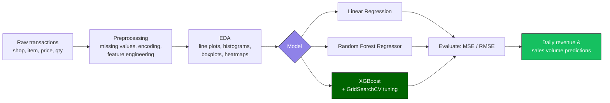

<a name="top"></a>
<div align="center">

# 🛍️ Retail Sales Prediction

### An end-to-end ML pipeline for forecasting daily revenue and sales volume

[](https://python.org)
[](https://scikit-learn.org)
[](https://xgboost.readthedocs.io)
[](https://jupyter.org)
[](LICENSE)

Transaction-level data in (shop, item, price, quantity) → daily revenue and sales-volume predictions out.

[Features](#-features) · [How it works](#%EF%B8%8F-how-it-works) · [Stack](#%EF%B8%8F-tech-stack) · [Quickstart](#%EF%B8%8F-installation) · [Results](#-example-results)

</div>

---

## 🎯 Why this project

Retail transaction logs are messy and granular — one row per sale, no obvious "revenue today" number sitting in a column. This pipeline takes raw shop/item/price/quantity records, engineers proper features out of them, and benchmarks three regression approaches against each other to see which actually predicts revenue best.



---

## 🚀 Features

| Feature | Description |
|---|---|
| 🧹 **Preprocessing** | Missing-value handling, categorical encoding, feature engineering |
| 🔍 **EDA** | Line plots, histograms, boxplots, and heatmaps to understand sales patterns |
| 🧮 **Predictive modeling** | Random Forest Regressor, Linear Regression, and XGBoost with GridSearchCV tuning |
| 📈 **Evaluation** | MSE and RMSE across all three models for direct comparison |

---

## ⚙️ How it works

1. **Load transactions** — shop, item, price, quantity at the row level
2. **Preprocess** — handle missing values, encode categorical fields, engineer new features
3. **Explore** — visualize distributions and correlations before modeling
4. **Train** — fit Linear Regression, Random Forest, and XGBoost on the same features
5. **Tune** — GridSearchCV sweeps XGBoost hyperparameters for the best fit
6. **Evaluate** — compare models on MSE/RMSE to pick a winner
7. **Predict** — output daily revenue and sales-volume forecasts

---

## 🧱 Tech Stack


---

## 🗂️ Project Structure

```
retail-sales-prediction/
├── Untitled24.ipynb        # Main notebook — preprocessing, EDA, modeling
├── README.md                # Project documentation
├── requirements.txt         # Python dependencies
└── data/                    # Dataset (SALES.csv or similar)
```

---

## ⚙️ Installation

Clone the repository:

```bash
git clone https://github.com/your-username/retail-sales-prediction.git
cd retail-sales-prediction
```

Install dependencies:

```bash
pip install -r requirements.txt
```

---

## ▶️ Usage

Open the notebook in Jupyter or Colab:

```bash
jupyter notebook Untitled24.ipynb
```

Run all cells to walk through:

1. Preprocessing and feature engineering
2. Data visualization (EDA)
3. Model training and evaluation
4. Predictions for **daily revenue** and **sales volume**

---

## 📊 Example Results

| Model | RMSE (Revenue) |
|---|---|
| Random Forest Regressor | ≈ 1701.88 |
| Linear Regression | ≈ 1823.93 |
| XGBoost | Tuned via GridSearchCV for further gains |

Random Forest edges out Linear Regression here, and XGBoost's hyperparameter search leaves room to push performance further still.

---

## 🔮 Future Enhancements

- [ ] Time-series forecasting models (ARIMA, Prophet, LSTM)
- [ ] Automated feature engineering for holidays & promotions
- [ ] Deploy as a dashboard (Streamlit/Flask) for real-time prediction

---

## 🤝 Contributing

Pull requests are welcome — fork the repo, create a branch, and submit a PR with improvements or new features.

---

## 📜 License

Distributed under the **MIT License**.

<div align="center">

<a href="#top">⬆️ Back to top</a>

</div>
